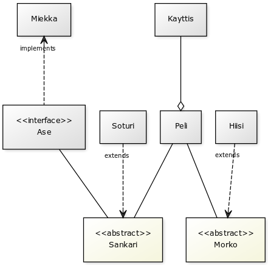

**Aihe:** Taistelupeli Luodaan Dungeons and Dragonsin viidennen edition, joka myös DnD-nextinä tunnetaan, säännöstöä mukaileva vuoropohjainen taistelupeli yhdelle pelaajalle. Pelaaja tulee taistelemaan erinäisiä tietokoneen (lue: Random Number Generatorin) ohjaamia vihollisia vastaan samalla edeten tekstipohjaisen lineaarisen tarinan mukaan.

Tarinan edetessä tulee pelaaja saamaan toimintakykyä kohottavia esineitä, kuten uusia aseita ja/tai panssareita, mahdollisesti myös esineisiin liittymättömiä lisiä, vaikkakin niitä on vaikeampi huomata toiminnassa.

**Käyttäjät:** Pelaaja

**Pelaajan toiminnot:**

* Seuraavaan tekstiin/hyökkäykseen siirtyminen
* Hahmokohtaisen erikoistoiminnan käyttäminen
  * Toistaiseksi suunnitteilla ei ole kuin yksi hahmoluokka, soturi
* Hyökkäyksen tekeminen
* Pelin päättyminen antaa mahdollisuuden aloittaa heti uudestaan

###### Luokkakaavio
<<<<<<< HEAD

=======

>>>>>>> bf96a0e486b1e0c604ed78bf6185eff44c5cbcfd
