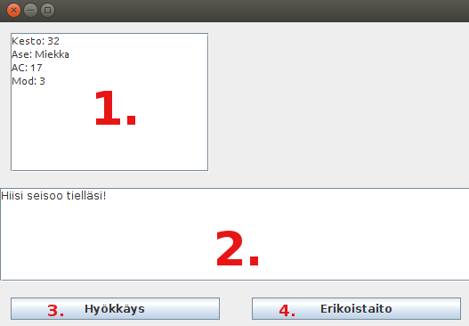

## Käyttöohjeet

Taistelupelin käyttöliittymä on pohjimmiltaan hyvin yksinkertainen.

1. Pelaajan tiedot
  * Kesto kertoo kuinka paljon vahinkoa pystyt ottamaan ennen tappiota.
  * Ase kertoo mikä ase on käytössä.
  * AC kertoo kuinka vaikea sinuun on osua, enempi parempi.
  * Mod on positiivinen muuttuja joka lisätään osumatarkkuuteen ja vahinkoon.
2. Inforuutu
  * Tänne päivittyy kaikki mitä pelissä tapahtuu.
3. Hyökkäysnappi
  * Tätä klikkaamalla pelihahmosi tekee hyökkäyksen vastustajaan. Menestys ei kuitenkaan ole taattu, sillä joka hyökkäykseen kuuluu pelin suorittama nopanheitto vastustajasi piilotettua AC:ta vastaan!
4. Erikoistationappi
  * Tätä klikkaamalla pelihahmosi suorittaa erikoistaitonsa, soturin (toistaiseksi ainoa pelattava) kyseinen temppu on nostaa AC arvoaan. Bonus peruuntuu kun teet seuraavan hyökäyksesi.

### Voittaminen ja häviäminen

Pelin voittaminen tapahtuu kurmottamalla kaikki vastaantulevat pahikset maanrakoon, jonka jälkeen avautuu uusi ikkuna jossa voi halutessaan aloittaa alusta tai sulkea pelin.

Häviäminen on seuraus sille, jos hahmosi kesto putoaa nollaan tai sen alle. Tällöinkin uutta peliä trjoava ikkuna pompsahtaa eteesi.
